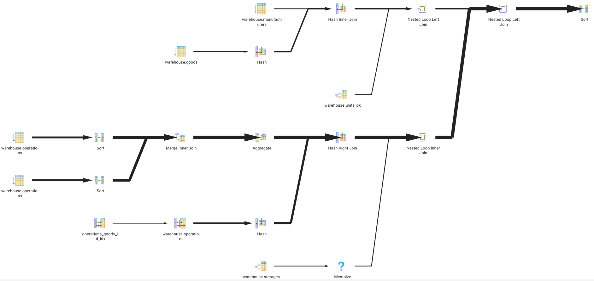
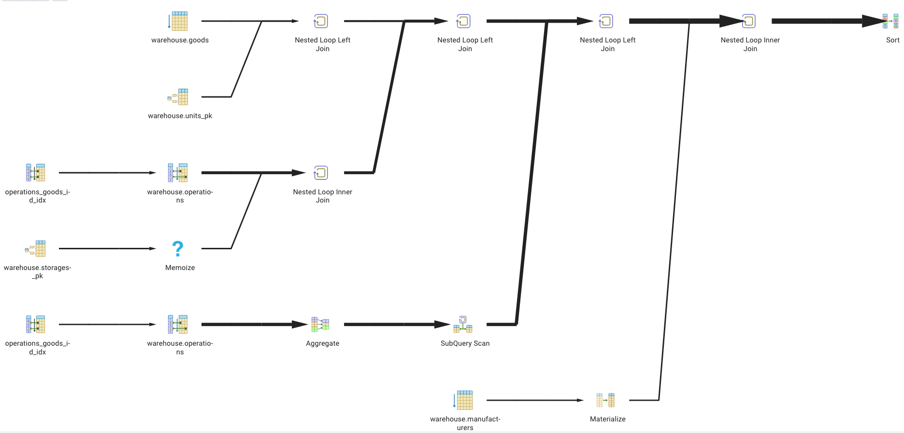

# Работа с join'ами, статистикой

## 1. Реализовать прямое соединение двух или более таблиц

```postgresql
select *
from manufacturers m
	inner join goods g
		on m.manufacturer_id = g.manufacturer_id
	inner join units u
		on g.unit_id = u.unit_id;
```

Получили список товаров с производителями и указанными единицами измерения (необязательны). Следовательно, товары без единиц измерения исключены.


## 2. Реализовать левостороннее (или правостороннее) соединение двух или более таблиц

```postgresql
select *
from manufacturers m
	left outer join goods g
		on m.manufacturer_id = g.manufacturer_id
	left outer join units u
		on g.unit_id = u.unit_id
where g.goods_id is null
	or u.unit_id is null;
```

Получили список производителей с "проблемами":

1. в справочнике товаров отсутствуют товары производителя (goods_id is null);
2. в справочнике товаров существуют товары, у которых не указаны единицы измерения (unit_id is null).


## 3. Реализовать кросс соединение двух или более таблиц

```postgresql
select *
from manufacturers m
	cross join goods g
	cross join units u;
```

"Перемножили" по-картезиански отношения "производители", "товары", "единицы измерения". Результат 120000 = 100 * 300 * 4. Не встречал в практике необходимость получения всех комбинаций значений атрибутов связанных отношений.


## 4. Реализовать полное соединение двух или более таблиц

```postgresql
select *
from manufacturers m
	full outer join goods g
		on m.manufacturer_id = g.manufacturer_id
	full outer join units u
		on g.unit_id = u.unit_id;
```

Получили полный список, в котором отображаются производители, товары и единицы измерения. В списке легко найти "аномалии" в данных:

1. производителей, для которых отсутствуют товары в одноимённом справочнике (goods.goods_id is null);
2. товары, для которых не указаны единицы измерений (goods.unit_id is null);
3. единицы измерения, которые не используются в справочнике товаров (goods.goods_id is null).

Однако, чаще всего я использую это соединение для сравнения двух отношений при поиске изменений в двух версиях данных одного и того же объекта. Отсутствие значения атрибута первичного ключа (или обязатальноего атрибута) в отношении предыдущей версии означает добавление новой записи (INSERT INTO), отсутствие значения атрибута первичного ключа в отношении новой версии – удаление записи (DELETE FROM), а различия в значениях одноимённых атрибутов – изменения (UPDATE).


## 5. Реализовать запрос, в котором будут использованы разные типы соединений

```postgresql
select *
from operations o
	natural right outer join storages s
	natural right outer join goods g
	natural left outer join units u
	natural join manufacturers m;
```

Получили список всех товаров и их производителей, включая, но не ограничиваясь единицами измерения, операциями на складе и местами хранения. При всей компактности и кажущейся простоте NATURAL JOIN, для меня чтение такого запроса стало сложнее. Не смотря на то, что первое отношение в клаузе FROM – операции на складе, их как раз может и не быть, равно как и мест хранения (зависят от операций) с единицами измерения (не обязательны для товаров). Основными отношениями в данном случае являются товары и производители. Предположить поведение глядя на код невозможно.

_Примечание. Для реализации NATURAL JOIN пришлось отказаться от многолетней привычки нотации атрибутов без избыточного описания (goods.id в списке объектов, operation.goods_id - ссылка; goods.name – наименование объекта в списке объектов, <<relation_alias>>.goods_name – для вывода в интерфейс, отчёт, денормализованные хранилища и т.п.), воспитанной у меня коллегами. Однако, устойчивость существующего кода при частых изменениях (особенно в начале проекта), на мой субъективный взгляд, сильно снижается (если нет жёсткой дисциплины в отношении договорённостей о нотации, или вы не исповедуете Test Driven Development, или нет жёсткого разделения по областям между разработчиками)._


Допустим, что понадобились данные для карточки движений товара по складу и нужен исходящий остаток...

Рассчитаем остаток товара с идентификатором 285 по окончанию каждой складской операции для каждого места хранения через CTE (через левое внешнее соединение) и получим статистику выполнения запроса.

```postgresql
explain (costs, verbose, analyze)
with outboundrest as (
	select o1.operation_id, sum(o0.quantity) as rest
	from operations o0	-- предыдущие и текущая операции
		inner join operations o1 -- текущая операция
			on o0.goods_id = o1.goods_id
				and o0.storage_id = o1.storage_id
	where o0.operation_id <= o1.operation_id
	group by o1.operation_id, o1.goods_id, o1.storage_id
)
select *
from operations o
	natural right outer join storages s
	natural right outer join goods g
	natural left outer join units u
	natural join manufacturers m
	left outer join outboundrest obr using(operation_id)
where g.goods_id = 285
order by obr.operation_id;

Successfully run. Total query runtime: 5 secs 272 msec.

Sort (cost=83087.6..83087.81 rows=84 width=378) (actual=5195.528..5195.543 rows=84 loops=1)
```




5 секунд – слишком долго для получения 84-х строк. Находим источник низкого быстродейския – "Merge Join", который собирает в CTE количество товаров для всех операций, предшествующих текущей. В итоге, собираются данные без учёта фильтра основного запроса.


		Merge Join  (cost=4662.68..76306.38 rows=1190813 width=18) (actual time=22.740..2604.117 rows=5258695.00 loops=1)
		Output: o1.operation_id, o0.quantity, o1.goods_id, o1.storage_id                                                                                                                             |
            Merge Cond: ((o0.goods_id = o1.goods_id) AND (o0.storage_id = o1.storage_id))                                                                                                                |
            Join Filter: (o0.operation_id <= o1.operation_id)                                                                                                                                            |
            Rows Removed by Join Filter: 5232709                                                                                                                                                         |
            Buffers: shared hit=332                                                                                                                                                                      |
            ->  Sort  (cost=2331.34..2396.31 rows=25986 width=18) (actual time=12.673..19.191 rows=25986.00 loops=1)                                                                                     |
                  Output: o0.quantity, o0.goods_id, o0.storage_id, o0.operation_id                                                                                                                       |
                  Sort Key: o0.goods_id, o0.storage_id                                                                                                                                                   |
                  Sort Method: quicksort  Memory: 1784kB                                                                                                                                                 |
                  Buffers: shared hit=166                                                                                                                                                                |
                  ->  Seq Scan on warehouse.operations o0  (cost=0.00..425.86 rows=25986 width=18) (actual time=0.005..3.084 rows=25986.00 loops=1)                                                      |
                        Output: o0.quantity, o0.goods_id, o0.storage_id, o0.operation_id                                                                                                                 |
                        Buffers: shared hit=166                                                                                                                                                          |
            ->  Sort  (cost=2331.34..2396.31 rows=25986 width=12) (actual time=10.054..698.307 rows=10491285.00 loops=1)                                                                                 |
                  Output: o1.operation_id, o1.goods_id, o1.storage_id                                                                                                                                    |
                  Sort Key: o1.goods_id, o1.storage_id                                                                                                                                                   |
                  Sort Method: quicksort  Memory: 1581kB                                                                                                                                                 |
                  Buffers: shared hit=166                                                                                                                                                                |
                  ->  Seq Scan on warehouse.operations o1  (cost=0.00..425.86 rows=25986 width=12) (actual time=0.027..2.951 rows=25986.00 loops=1)                                                      |
                        Output: o1.operation_id, o1.goods_id, o1.storage_id                                                                                                                              |
                        Buffers: shared hit=166 


Попробуем оптимизировать запрос, используя LATERAL-подзапрос, чтобы сократить количество обрабатываемых строк в таблице складских операций при помощи фильтрации параметрами из основного запроса.


 ```postgresql
explain (costs, verbose, analyze)
select *
from operations o
	natural right outer join storages s
	natural right outer join goods g
	natural left outer join units u
	natural join manufacturers m
	left outer join lateral (
		select o.operation_id, sum(o0.quantity) as rest
		from operations o0	-- предыдущие и текущая операции
		where o0.operation_id <= o.operation_id
			and o0.goods_id = o.goods_id
			and o0.storage_id = o.storage_id
		group by o.operation_id, o.goods_id, o.storage_id
	) obr using(operation_id)
where g.goods_id = 285
order by obr.operation_id;

Successfully run. Total query runtime: 119 msec.

Sort (cost=15736.06..15736.27 rows=84 width=378) (actual=6.386..6.394 rows=84 loops=1)
```




Теперь сумма операций на складе теперь обрабатывается при помощи "Subquery Scan", отфильтрованных по идентификатору товара.

              ->  Subquery Scan on obr  (cost=6.28..183.78 rows=1 width=36) (actual time=0.064..0.065 rows=1.00 loops=84)
                    Output: obr.operation_id, obr.rest, (o.goods_id), (o.storage_id)
                    Filter: (o.operation_id = obr.operation_id)
                    Buffers: shared hit=4788
                    ->  GroupAggregate  (cost=6.28..183.77 rows=1 width=44) (actual time=0.063..0.063 rows=1.00 loops=84)
                          Output: o.operation_id, sum(o0.quantity), o.goods_id, o.storage_id
                          Buffers: shared hit=4788
                          ->  Bitmap Heap Scan on warehouse.operations o0  (cost=6.28..183.68 rows=29 width=6) (actual time=0.012..0.051 rows=42.50 loops=84)
                                Output: o0.operation_id, o0.goods_id, o0.storage_id, o0.quantity
                                Recheck Cond: (o0.goods_id = o.goods_id)
                                Filter: ((o0.operation_id <= o.operation_id) AND (o0.storage_id = o.storage_id))
                                Rows Removed by Filter: 42
                                Heap Blocks: exact=4620
                                Buffers: shared hit=4788
                                ->  Bitmap Index Scan on operations_goods_id_idx  (cost=0.00..6.27 rows=265 width=0) (actual time=0.006..0.006 rows=84.00 loops=84)
                                      Index Cond: (o0.goods_id = o.goods_id)
                                      Index Searches: 84
                                      Buffers: shared hit=168

## 6. Сделать комментарии на каждый запрос

_см. предыдущих пунктах._


## 7. К работе приложить структуру таблиц, для которых выполнялись соединения

_см. файл [Joins.sql](Joins.sql)_