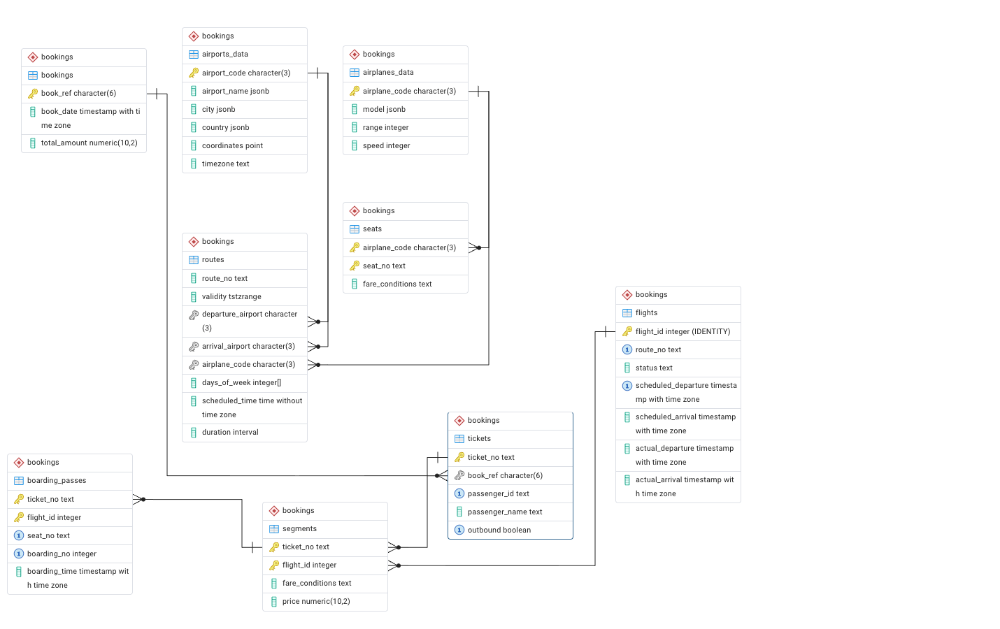

# Секционирование таблицы

## Анализ структуры данных:

Ознакомьтесь с таблицами базы данных, особенно с таблицами bookings, tickets, ticket_flights, flights, boarding_passes, seats, airports, aircrafts.
Определите, какие данные в таблице bookings или других таблицах имеют логическую привязку к диапазонам, по которым можно провести секционирование (например, дата бронирования, рейсы).

_Получим и развернём базу._

```bash
sudo wget https://edu.postgrespro.ru/demo-20250901-2y.sql.gz

sudo gunzip -c demo-20250901-2y.sql.gz | psql -d postgres
```



## Выбор таблицы для секционирования:
Основной акцент делается на секционировании таблицы bookings. Но вы можете выбрать и другие таблицы, если видите в этом смысл для оптимизации производительности (например, flights, boarding_passes).
Обоснуйте свой выбор: почему именно эта таблица требует секционирования? Какой тип данных является ключевым для секционирования?

_Предположим, что решили увеличить производительность при поиске билетов, не зарегистрированных на посадку. Зарегистрированные на рейс билеты хранятся в таблице `bookings.boarding_passes`, проданные на рейсы билеты – в таблице `bookings.segments`. В обоих таблицах первичный ключ составной из колонок `ticket_no` и `flight_id`._

_Поскольку, задача состоит в сравнении списка проданных билетов на рейс и списка билетов, предъявленных для регистрации на посадку пассажирами, то секционировать следует обе таблицы по целочисленному идентификатору рейса `flight_id`._


## Определение типа секционирования:
Определитесь с типом секционирования, которое наилучшим образом подходит для ваших данных:

По диапазону (например, по дате бронирования или дате рейса).
По списку (например, по пунктам отправления или по номерам рейсов).
По хэшированию (для равномерного распределения данных).

_Самый подходящий тип секционирования для целого числа – по диапазону (множество возрастающих значений во времени, данные по выполненным рейсам не будут меняться и останутся в секции, в которой были зарегистрированы)._

## Создание секционированной таблицы:
Преобразуйте таблицу в секционированную с выбранным типом секционирования.
Например, если вы выбрали секционирование по диапазону дат бронирования, создайте секции по месяцам или годам.

_Идентификатор рейса является суррогатным ключом, поэтому будем искать баланс между количеством секций и количеством записей в секции. Исследуем соотношение количества рейсов к общему количеству записей в таблицах._

```postgresql
select count(distinct flight_id) as flight_cnt, count(*) as cnt, count(*) / count(distinct flight_id) as tickets_per_flight from bookings.segments;
 flight_cnt |   cnt    | tickets_per_flight 
------------+----------+--------------------
     133795 | 27580257 |                206

select count(distinct flight_id) as flight_cnt, count(*) as cnt, count(*) / count(distinct flight_id) as tickets_per_flight from bookings.boarding_passes;
 flight_cnt |   cnt    | tickets_per_flight 
------------+----------+--------------------
     124534 | 26299160 |                211
```

_Итого: ~200 билетов на рейс при общем количестве билетов с указанными рейсами более 26 миллионов. Разобъём данные на секции по 1000 рейсов, чтобы содержимое секции было около 200 000 записей._

```postgresql
select (flight_id / 1000) * 1000 as range_from, ((flight_id / 1000) + 1) * 1000 as range_to, count(*) as cnt
from bookings.boarding_passes group by (flight_id / 1000) order by range_from;
 range_from | range_to |  cnt   
------------+----------+--------
          0 |     1000 | 233923
       1000 |     2000 | 216017
       2000 |     3000 | 229950
       3000 |     4000 | 211502
...
     121000 |   122000 | 198898
     122000 |   123000 | 195184
     123000 |   124000 | 190543
     124000 |   125000 | 168576
     125000 |   126000 |   3463
(126 rows)
```


## Миграция данных:

Перенесите существующие данные из исходной таблицы в секционированную структуру.
Убедитесь, что все данные правильно распределены по секциям.

_Код создания схемы секционированных таблиц, создания секций и заполнения их данными в файле [Partition.sql](Partition.sql)_

_Перенос данных осуществим порциями, кратными секциям._

```postgresql
CREATE TABLE bookings.segments_range_000001000
PARTITION OF bookings.segments_range
FOR VALUES FROM (0) TO (1000);

insert into bookings.segments_range
    select * from bookings.segments where flight_id >= 0 and flight_id < 1000;
```

_Видим, что в секциях содержится планируемое количество записей, минимальное и максимальное значения flight_id соответствуют диапазону значений секции._

```postgresql
SELECT tableoid::regclass as tablename, count(*) as cnt, min(flight_id) as mnvalue, max(flight_id) as mxvalue FROM bookings.boarding_passes_range GROUP BY tableoid;
            tablename            |  cnt   | mnvalue | mxvalue 
---------------------------------+--------+---------+---------
 boarding_passes_range_000001000 | 233923 |       1 |     999
 boarding_passes_range_000002000 | 216017 |    1000 |    1999
 boarding_passes_range_000003000 | 229950 |    2000 |    2999
 boarding_passes_range_000004000 | 211502 |    3000 |    3999
...
 boarding_passes_range_000122000 | 198898 |  121000 |  121999
 boarding_passes_range_000123000 | 195184 |  122000 |  122999
 boarding_passes_range_000124000 | 190543 |  123000 |  123999
 boarding_passes_range_000125000 | 168576 |  124000 |  124999
 boarding_passes_range_000126000 |   3463 |  125000 |  125870
(126 rows)
```


## Оптимизация запросов:

Проверьте, как секционирование влияет на производительность запросов. Выполните несколько выборок данных до и после секционирования для оценки времени выполнения.
Оптимизируйте запросы при необходимости (например, добавьте индексы на ключевые столбцы).


_Получение списка билетов, по которым отсутствует регистрация на рейс без секционирования._

```postgresql
explain (costs, timing, verbose, analyze)
SELECT s.ticket_no
FROM bookings.segments s
    LEFT OUTER JOIN bookings.boarding_passes bp
        ON s.ticket_no = bp.ticket_no
            AND s.flight_id = bp.flight_id
WHERE s.flight_id = 451
    AND bp.ticket_no is NULL;
                                                                                      QUERY PLAN                                                                                      
--------------------------------------------------------------------------------------------------------------------------------------------------------------------------------------
 Hash Anti Join  (cost=628.62..658.63 rows=282 width=14) (actual time=4.038..4.041 rows=0 loops=1)
   Output: s.ticket_no
   Hash Cond: ((s.flight_id = bp.flight_id) AND (s.ticket_no = bp.ticket_no))
   ->  Index Scan using segments_flight_id_idx on bookings.segments s  (cost=0.44..26.14 rows=282 width=18) (actual time=0.055..1.211 rows=404 loops=1)
         Output: s.ticket_no, s.flight_id, s.fare_conditions, s.price
         Index Cond: (s.flight_id = 451)
   ->  Hash  (cost=622.96..622.96 rows=348 width=18) (actual time=2.680..2.681 rows=404 loops=1)
         Output: bp.ticket_no, bp.flight_id
         Buckets: 1024  Batches: 1  Memory Usage: 29kB
         ->  Index Scan using boarding_passes_flight_id_seat_no_key on bookings.boarding_passes bp  (cost=0.44..622.96 rows=348 width=18) (actual time=0.066..2.554 rows=404 loops=1)
               Output: bp.ticket_no, bp.flight_id
               Index Cond: (bp.flight_id = 451)
 Planning Time: 1.130 ms
 Execution Time: 4.144 ms
```


_Получение списка билетов, по которым отсутствует регистрация на рейс секционирования._

```postgresql
explain (costs, timing, verbose, analyze)
SELECT s.ticket_no
FROM bookings.segments_range s
    LEFT OUTER JOIN bookings.boarding_passes_range bp
        ON s.ticket_no = bp.ticket_no
            AND s.flight_id = bp.flight_id
WHERE s.flight_id = 451
    AND bp.ticket_no is NULL;
                                                                                                      QUERY PLAN                                                                                                      
----------------------------------------------------------------------------------------------------------------------------------------------------------------------------------------------------------------------
 Hash Anti Join  (cost=759.36..791.51 rows=222 width=14) (actual time=0.364..0.365 rows=0 loops=1)
   Output: s.ticket_no
   Hash Cond: ((s.flight_id = bp.flight_id) AND (s.ticket_no = bp.ticket_no))
   ->  Index Scan using segments_range_000001000_flight_id_idx on bookings.segments_range_000001000 s  (cost=0.29..19.07 rows=444 width=18) (actual time=0.016..0.097 rows=404 loops=1)
         Output: s.ticket_no, s.flight_id
         Index Cond: (s.flight_id = 451)
   ->  Hash  (cost=752.05..752.05 rows=468 width=18) (actual time=0.183..0.184 rows=404 loops=1)
         Output: bp.ticket_no, bp.flight_id
         Buckets: 1024  Batches: 1  Memory Usage: 29kB
         ->  Index Scan using boarding_passes_range_000001000_flight_id_seat_no_key on bookings.boarding_passes_range_000001000 bp  (cost=0.42..752.05 rows=468 width=18) (actual time=0.026..0.088 rows=404 loops=1)
               Output: bp.ticket_no, bp.flight_id
               Index Cond: (bp.flight_id = 451)
 Planning Time: 0.246 ms
 Execution Time: 0.383 ms
```

_Результат: операция сканирование индекса применяется в обоих случаях, однако, из-за меньшего размера данных в секции, производительность увеличилась в 8 раз._


## Тестирование решения:
Протестируйте секционирование, выполняя несколько запросов к секционированной таблице.
Проверьте, что операции вставки, обновления и удаления работают корректно.

_Запрос по идентификатору рейса выполняется в пределах секции, которой принадлежит идентификатор._

```postgresql
explain (costs, timing, verbose, analyze)
SELECT sum(s.price) as Total, MIN(b.boarding_time) as firstboarded, MAX(b.boarding_time) as lastboarded
FROM bookings.segments_range s
    INNER JOIN bookings.boarding_passes_range b
        ON s.ticket_no = b.ticket_no
            and b.flight_id = s.flight_id
WHERE s.flight_id = 451;
                                                                                                     QUERY PLAN                                                                                                      
---------------------------------------------------------------------------------------------------------------------------------------------------------------------------------------------------------------------
 Aggregate  (cost=821.76..821.77 rows=1 width=48) (actual time=0.472..0.474 rows=1 loops=1)
   Output: sum(s.price), min(b.boarding_time), max(b.boarding_time)
   ->  Hash Join  (cost=25.04..813.96 rows=1039 width=13) (actual time=0.222..0.376 rows=404 loops=1)
         Output: s.price, b.boarding_time
         Hash Cond: (b.ticket_no = s.ticket_no)
         ->  Index Scan using boarding_passes_range_000001000_flight_id_seat_no_key on bookings.boarding_passes_range_000001000 b  (cost=0.42..752.05 rows=468 width=26) (actual time=0.051..0.121 rows=404 loops=1)
               Output: b.boarding_time, b.ticket_no, b.flight_id
               Index Cond: (b.flight_id = 451)
         ->  Hash  (cost=19.07..19.07 rows=444 width=23) (actual time=0.158..0.158 rows=404 loops=1)
               Output: s.price, s.ticket_no, s.flight_id
               Buckets: 1024  Batches: 1  Memory Usage: 31kB
               ->  Index Scan using segments_range_000001000_flight_id_idx on bookings.segments_range_000001000 s  (cost=0.29..19.07 rows=444 width=23) (actual time=0.016..0.087 rows=404 loops=1)
                     Output: s.price, s.ticket_no, s.flight_id
                     Index Cond: (s.flight_id = 451)
 Planning Time: 0.396 ms
 Execution Time: 0.524 ms
```

```postgresql
explain (costs, timing, verbose, analyze)
SELECT sum(s.price) as Total, MIN(b.boarding_time) as firstboarded, MAX(b.boarding_time) as lastboarded
FROM bookings.segments_range s
    INNER JOIN bookings.boarding_passes_range b
        ON s.ticket_no = b.ticket_no
            and b.flight_id = s.flight_id
WHERE s.flight_id = 105001;
                                                                                                     QUERY PLAN                                                                                                      
---------------------------------------------------------------------------------------------------------------------------------------------------------------------------------------------------------------------
 Aggregate  (cost=318.99..319.00 rows=1 width=48) (actual time=1.519..1.524 rows=1 loops=1)
   Output: sum(s.price), min(b.boarding_time), max(b.boarding_time)
   ->  Hash Join  (cost=14.94..317.69 rows=174 width=13) (actual time=1.053..1.368 rows=257 loops=1)
         Output: s.price, b.boarding_time
         Hash Cond: (b.ticket_no = s.ticket_no)
         ->  Index Scan using boarding_passes_range_000106000_flight_id_seat_no_key on bookings.boarding_passes_range_000106000 b  (cost=0.42..300.78 rows=174 width=26) (actual time=0.500..0.652 rows=257 loops=1)
               Output: b.boarding_time, b.ticket_no, b.flight_id
               Index Cond: (b.flight_id = 105001)
         ->  Hash  (cost=12.34..12.34 rows=174 width=23) (actual time=0.529..0.530 rows=258 loops=1)
               Output: s.price, s.ticket_no, s.flight_id
               Buckets: 1024  Batches: 1  Memory Usage: 23kB
               ->  Index Scan using segments_range_000106000_flight_id_idx on bookings.segments_range_000106000 s  (cost=0.29..12.34 rows=174 width=23) (actual time=0.191..0.340 rows=258 loops=1)
                     Output: s.price, s.ticket_no, s.flight_id
                     Index Cond: (s.flight_id = 105001)
 Planning Time: 0.948 ms
 Execution Time: 1.631 ms
```

_Однако, почему-то время выполнения по первой секции в 3 раза меньше, чем по 106-й секции. Хотя, размер данных в этих секциях сравним и больше в 1-й секции (количество записей и размер данных на 15%)._

```postgresql
SELECT tableoid::regclass as tablename, count(*) as cnt,
    pg_total_relation_size(tableoid) as tablesize, pg_indexes_size(tableoid) as indexsize
FROM bookings.boarding_passes_range
WHERE tableoid::regclass IN ('boarding_passes_range_000001000', 'boarding_passes_range_000106000')
GROUP BY tableoid;

            tablename            |  cnt   | tablesize | indexsize 
---------------------------------+--------+-----------+-----------
 boarding_passes_range_000001000 | 233923 |  40550400 |  24535040
 boarding_passes_range_000106000 | 197162 |  34086912 |  20586496


SELECT tableoid::regclass as tablename, count(*) as cnt,
	pg_total_relation_size(tableoid) as tablesize, pg_indexes_size(tableoid) as indexsize
FROM bookings.segments_range 
WHERE tableoid::regclass IN ('segments_range_000001000', 'segments_range_000106000')
GROUP BY tableoid;

        tablename         |  cnt   | tablesize | indexsize 
--------------------------+--------+-----------+-----------
 segments_range_000001000 | 233923 |  29990912 |  13975552
 segments_range_000106000 | 197163 |  25255936 |  11747328
```


_Вставка записи нового плеча перелёта произошла в правильную секцию (видим срабатывание триггеров проверки ограничения внешних ключей для секции segments_range_000136000: 135000..135999)._

```postgresql
explain (costs, timing, verbose, analyze)
insert into bookings.segments_range (ticket_no, flight_id, fare_conditions, price)
	values('0005432012864', 135571, 'Economy', 7250);

                                                            QUERY PLAN                                                             
-----------------------------------------------------------------------------------------------------------------------------------
 Insert on bookings.segments_range  (cost=0.00..0.01 rows=0 width=0) (actual time=13.138..13.139 rows=0 loops=1)
   ->  Result  (cost=0.00..0.01 rows=1 width=84) (actual time=0.003..0.004 rows=1 loops=1)
         Output: '0005432012864'::text, 135571, 'Economy'::text, 7250.00::numeric(10,2)
 Planning Time: 0.148 ms
 Trigger RI_ConstraintTrigger_c_53560 for constraint segments_range_flight_id_fkey on segments_range_000136000: time=4.095 calls=1
 Trigger RI_ConstraintTrigger_c_53563 for constraint segments_range_ticket_no_fkey on segments_range_000136000: time=6.685 calls=1
 Execution Time: 28.865 ms
```

_Обновление условий тарифа и цены также произошло после поиска в секции с условным номером 136000 (видим операцию сканирования индекса segments_range_000136000_pkey и обновление секции segments_range_000136000)._

```postgresql
explain (costs, timing, verbose, analyze)
update bookings.segments_range set fare_conditions = 'Business', price = 14500 where ticket_no = '0005432012864' and flight_id = 135571;
                                                                                       QUERY PLAN                                                                                        
-----------------------------------------------------------------------------------------------------------------------------------------------------------------------------------------
 Update on bookings.segments_range  (cost=0.29..8.31 rows=0 width=0) (actual time=0.520..0.522 rows=0 loops=1)
   Update on bookings.segments_range_000136000 segments_range_1
   ->  Index Scan using segments_range_000136000_pkey on bookings.segments_range_000136000 segments_range_1  (cost=0.29..8.31 rows=1 width=58) (actual time=0.053..0.055 rows=1 loops=1)
         Output: 'Business'::text, 14500.00::numeric(10,2), segments_range_1.tableoid, segments_range_1.ctid
         Index Cond: ((segments_range_1.ticket_no = '0005432012864'::text) AND (segments_range_1.flight_id = 135571))
 Planning Time: 1.518 ms
 Execution Time: 1.628 ms
```


_Обновление идентификатора рейса произошло после поиска в секции с условным номером 136000 (видим операцию сканирования индекса segments_range_000136000_pkey) и завершилось переносом в секцию segments_range_000106000, судя по срабатыванию триггеров проверки внешних ключей для секции segments_range_000106000._

```postgresql
explain (costs, timing, verbose, analyze)
update bookings.segments_range set flight_id = 105001 where ticket_no = '0005432012864' and flight_id = 135571;
                                                                                       QUERY PLAN                                                                                        
-----------------------------------------------------------------------------------------------------------------------------------------------------------------------------------------
 Update on bookings.segments_range  (cost=0.29..8.31 rows=0 width=0) (actual time=0.604..0.607 rows=0 loops=1)
   Update on bookings.segments_range_000136000 segments_range_1
   ->  Index Scan using segments_range_000136000_pkey on bookings.segments_range_000136000 segments_range_1  (cost=0.29..8.31 rows=1 width=14) (actual time=0.176..0.178 rows=1 loops=1)
         Output: 105001, segments_range_1.tableoid, segments_range_1.ctid
         Index Cond: ((segments_range_1.ticket_no = '0005432012864'::text) AND (segments_range_1.flight_id = 135571))
 Planning Time: 0.651 ms
 Trigger RI_ConstraintTrigger_a_55906 for constraint boarding_passes_range_ticket_no_flight_id_fkey on segments_range: time=0.330 calls=1
 Trigger RI_ConstraintTrigger_c_53080 for constraint segments_range_flight_id_fkey on segments_range_000106000: time=0.247 calls=1
 Trigger RI_ConstraintTrigger_c_53083 for constraint segments_range_ticket_no_fkey on segments_range_000106000: time=0.165 calls=1
 Execution Time: 1.439 ms
```


_Удаление плеча перелёта также произошло из секции с условным номером 106000 (видим операцию сканирования индекса segments_range_000106000_pkey и удаление из секции segments_range_000106000)._


```postgresql
explain (costs, timing, verbose, analyze)                                                                                                         delete from bookings.segments_range where ticket_no = '0005432012864' and flight_id = 105001;
                                                                                       QUERY PLAN                                                                                        
-----------------------------------------------------------------------------------------------------------------------------------------------------------------------------------------
 Delete on bookings.segments_range  (cost=0.42..8.44 rows=0 width=0) (actual time=0.253..0.255 rows=0 loops=1)
   Delete on bookings.segments_range_000106000 segments_range_1
   ->  Index Scan using segments_range_000106000_pkey on bookings.segments_range_000106000 segments_range_1  (cost=0.42..8.44 rows=1 width=10) (actual time=0.059..0.061 rows=1 loops=1)
         Output: segments_range_1.tableoid, segments_range_1.ctid
         Index Cond: ((segments_range_1.ticket_no = '0005432012864'::text) AND (segments_range_1.flight_id = 105001))
 Planning Time: 0.877 ms
 Trigger RI_ConstraintTrigger_a_56223 for constraint boarding_passes_range_ticket_no_flight_id_fkey106 on segments_range_000106000: time=7.119 calls=1
 Execution Time: 7.530 ms
```

Документирование:

Добавьте комментарии к коду, поясняющие выбранный тип секционирования и шаги его реализации.
Опишите, как секционирование улучшает производительность запросов и как оно может быть полезно в реальных условиях.
