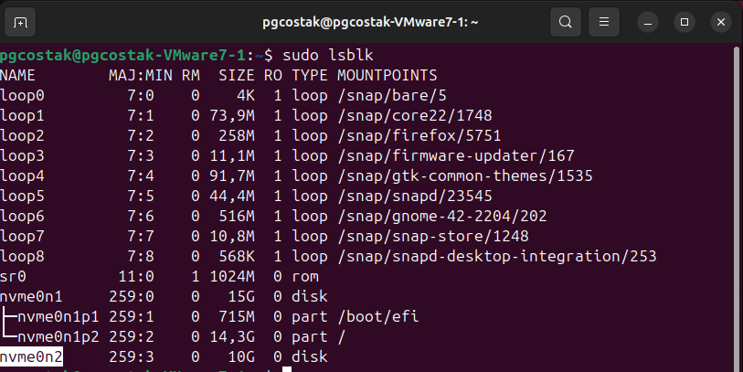

# Физический уровень PostgreSQL

## Установка Ubuntu 24.04 в VMWare Fusion 11.5 (macOS)

Запуск мастера создания машины (cmd + N)

Выбор скачанного заранее установочного образа Ubuntu

Выбор BIOS

Дополнительная настройка (кнопка "Customize Settings")

Выбор места сохранения файлов ВМ

Настройка ЦП, памяти и возможностей запуска ВМ внутри (ЦП = 2; Память = 4 ГБ)

Настройка диска ВМ (размер = 15 ГБ, тип = NVMe)

Обзор конфигурации

Запуск ВМ и установка Ubuntu

Установка VM Tools

	sudo apt install open-vm-tools-desktop -y

_Требуется перезапуск ВМ._

## Установка PostgreSQL 15 в Ubuntu

### Регистрация официальных пакетов в локальном репозитории apt

	sudo sh -c 'echo "deb http://apt.postgresql.org/pub/repos/apt $(lsb_release -cs)-pgdg main" > /etc/apt/sources.list.d/pgdg.list'

	wget -qO- https://www.postgresql.org/media/keys/ACCC4CF8.asc | sudo tee /etc/apt/trusted.gpg.d/pgdg.asc &>/dev/null

	sudo apt update && sudo apt upgrade -y

### Установка СУБД и клиента версии 15

	sudo apt install postgresql-15 postgresql-client-15 -y

Настройка запуска СУБД и проверка версии клиента

	sudo systemctl enable postgresql
	sudo systemctl status postgresql
	psql --version

Проверка кластера

	sudo -u postgres pg_lsclusters

	Ver Cluster Port Status Owner    Data directory              Log file
	15  main    5432 online postgres /var/lib/postgresql/15/main /var/log/postgresql/postgresql-15-main.log

Изменение пароля пользователя в СУБД

	sudo -u postgres psql

Создание таблицы test

	create table test(c1 text);
	insert into test values('1'),('2');

## Добавление дополнительного диска в Ubuntu 24.04 в VMWare Fusion 11.5 (macOS)

### Создание дополнительного диска

1. Настройки ___остановленной___ ВМ

2. Выбор типа добавляемого устройства (New hard disk)

3. Настройка диска ВМ (размер = 10 ГБ, тип = NVMe, Split into multiple files = [ ]). _Внимание! Обязательно отключить опцию "Split into multiple files" для получения единого файла диска._

4. Выбор папки, отличной от бандла ВМ, для сохранения файла диска

5. Сохранение файла диска

6. Проверка наличия файла диска

### Разметка нового диска

Определение имени диска

	sudo lsblk

Форматирование диска

	sudo mkfs -t ext4 /dev/nvme0n2

Создание точки монтирования и предоставление прав

	sudo mkdir /mnt/edisk2

Монтирование диска

	sudo mount -t ext4 /dev/nvme0n2 /mnt/edisk2
	sudo chown -R postgres:postgres /mnt/edisk2

Перезагрузка ВМ

Диск после перезагрузки монтируется для пользователя в папку /media/postgresql

Автоматическое монтирование диска

	sudo nano /etc/fstab

Регистрация автоматического монтирования диска в файле /etc/fstab

Перезагрузка ВМ

## Перенос кластера PostgreSQL на новый диск

Остановка кластера

	sudo -u postgres pg_ctlcluster 15 main stop

Перенос содержимого на новый диск

	sudo mv /var/lib/postgresql/15 /mnt/edisk2

Запуск кластера PostgreSQL

	sudo -u postgres pg_ctlcluster 15 main start
	Error: /var/lib/postgresql/15/main is not accessible or does not exist

_Настройки кластера указывают на папку, из которой данные перенесли. Данные отсутствуют._

Настройка положения новой папки с данными (_параметр data_directory в файле postgresql.conf_)

	sudo nano /etc/postgresql/15/main/postgresql.conf

Запуск кластера PostgreSQL

	sudo -u postgres pg_ctlcluster 15 main start
	Warning: the cluster will not be running as a systemd service. Consider using systemctl:
  		sudo systemctl start postgresql@15-main

_Не обнаружено роблем с автоматическим запуском кластера после перезапуска ВМ._

Проверка данных в таблице test

	sudo -u postgres psql

	psql (15.14 (Ubuntu 15.14-1.pgdg24.04+1))
	Type "help" for help.
	postgres=# select * from test;
	 c1 
	----
	 1
	 2
	 3
	(3 rows)

## Перенос данных кластера PostgreSQL в кластер на другой ВМ

### Создание ВМ (_аналогично предыдущей, с другим именем пользователя_)

Запуск мастера создания машины (cmd + N)

Выбор скачанного заранее установочного образа Ubuntu

Выбор BIOS

Дополнительная настройка (кнопка "Customize Settings")

Выбор места сохранения файлов ВМ

Настройка ЦП, памяти и возможностей запуска ВМ внутри (ЦП = 2; Память = 4 ГБ)

Настройка диска ВМ (размер = 15 ГБ, тип = NVMe)

Обзор конфигурации

Запуск ВМ и установка Ubuntu

Установка VM Tools

	sudo apt install open-vm-tools-desktop -y

_Требуется перезапуск ВМ._

### Установка PostgreSQL 15 в Ubuntu

#### Регистрация официальных пакетов в локальном репозитории apt

	sudo sh -c 'echo "deb http://apt.postgresql.org/pub/repos/apt $(lsb_release -cs)-pgdg main" > /etc/apt/sources.list.d/pgdg.list'

	wget -qO- https://www.postgresql.org/media/keys/ACCC4CF8.asc | sudo tee /etc/apt/trusted.gpg.d/pgdg.asc &>/dev/null

	sudo apt update && sudo apt upgrade -y

#### Установка СУБД и клиента версии 15

	sudo apt install postgresql-15 postgresql-client-15 -y

Настройка запуска СУБД и проверка версии клиента

	sudo systemctl enable postgresql
	sudo systemctl status postgresql
	psql --version

### Подключение дополнительного диска в Ubuntu 24.04 в VMWare Fusion 11.5 (macOS) (_из остановленной ВМ_)

1. Настройки остановленной ВМ

2. Выбор типа добавляемого устройства (Existing hard disk)

3. Выбор файла диска остановленной ВМ (_режим совместного использования_)

4. Регистрация диска ВМ (размер = 10 ГБ, тип = NVMe, Split into multiple files = [ ]). _Внимание! Соглашаемся с типом = SCSI, затем возвращаем NVMe._

5. Обзор конфигурации

### Монтирование дополнительного диска

Создание точки монтирования и предоставление прав (_используем другое имя папки монтирования_)

	sudo mkdir /mnt/data

Монтирование диска

	sudo mount -t ext4 /dev/nvme0n2 /mnt/data

Автоматическое монтирование диска

	sudo nano /etc/fstab

Регистрация автоматического монтирования диска в файле /etc/fstab (_UUID остался прежним_)

Перезагрузка ВМ

### Подключение данных кластера PostgreSQL с нового диска

Остановка кластера

	sudo -u postgres pg_ctlcluster 15 main stop

Удаление папки с данными кластера

	sudo rm -r /var/lib/postgresql/15

Настройка положения новой папки с данными (_параметр data_directory в файле postgresql.conf_)

	sudo nano /etc/postgresql/15/main/postgresql.conf

Запуск кластера PostgreSQL

	sudo -u postgres pg_ctlcluster 15 main start
	Warning: the cluster will not be running as a systemd service. Consider using systemctl:
  		sudo systemctl start postgresql@15-main

_Перезапуск ВМ приводит к автоматическому запуску кластера._

Проверка наличия таблицы test в базе postgres

	sudo -u postgres psql

	psql (15.14 (Ubuntu 15.14-1.pgdg24.04+1))
	Type "help" for help.
	postgres=# \dt
        List of relations
	 Schema | Name | Type  |  Owner   
	--------+------+-------+----------
	 public | test | table | postgres
	(1 row)

Проверка данных в таблице test

	postgres=# select * from test;
	 c1 
	----
	 1
	 2
	 3
	(3 rows)
