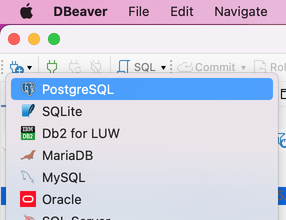
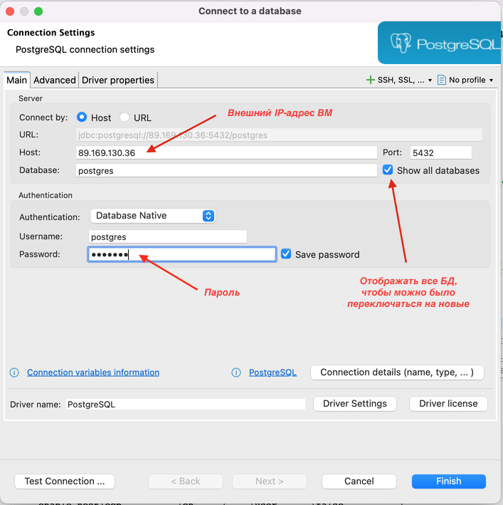
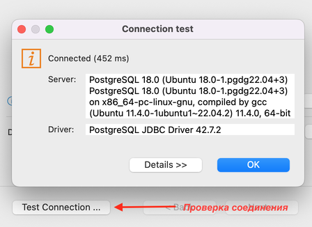
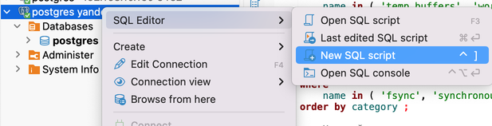
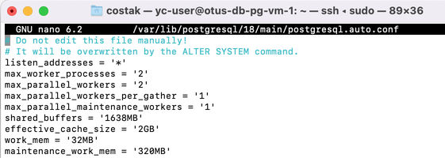

# Настройка PostgreSQL

## Создание ВМ в ЯО (аналогично предыдущему ДЗ)

Сеть:

    yc vpc network create --name otus-net --description "otus-net"


Подсеть:

    yc vpc subnet create --name otus-subnet --range 192.168.0.0/24 --network-name otus-net --description "otus-subnet"


Установка ВМ:

    yc compute instance create --name otus-db-pg-vm-1 --hostname otus-db-pg-vm-1 --cores 2 --memory 4 --create-boot-disk size=15G,type=network-hdd,image-folder-id=standard-images,image-family=ubuntu-2204-lts --network-interface subnet-name=otus-subnet,nat-ip-version=ipv4 --ssh-key ~/ya_key.pub


Поиск IP-адреса для подключения:

    yc compute instances list

    +----------------------+-----------------+---------------+---------+---------------+--------------+
    |          ID          |      NAME       |    ZONE ID    | STATUS  |  EXTERNAL IP  | INTERNAL IP  |
    +----------------------+-----------------+---------------+---------+---------------+--------------+
    | fhmsedv4u1lkdksi73do | otus-db-pg-vm-1 | ru-central1-a | RUNNING | 89.169.130.36 | 192.168.0.22 |
    +----------------------+-----------------+---------------+---------+---------------+--------------+


Подключение к ВМ:

    ssh -i ~/.ssh/ya_key -l yc-user 89.169.130.36


Установка PostgreSQL (текущая версия)):
```
sudo apt update && sudo apt upgrade -y -q && sudo sh -c 'echo "deb http://apt.postgresql.org/pub/repos/apt $(lsb_release -cs)-pgdg main" > /etc/apt/sources.list.d/pgdg.list' && wget --quiet -O - https://www.postgresql.org/media/keys/ACCC4CF8.asc | sudo apt-key add - && sudo apt-get update && sudo apt -y install postgresql
```

## Настройка доступа из кластеру из сети

Проверка статуса кластера:

    pg_lsclusters

    Ver Cluster Port Status Owner    Data directory              Log file
    18  main    5432 online postgres /var/lib/postgresql/18/main /var/log/postgresql/postgresql-18-main.log

Подключение к СУБД:

    sudo -u postgres psql


Получение расположения основного файла конфигурации:

    show config_file;

                config_file
    -----------------------------------------
    /etc/postgresql/18/main/postgresql.conf
    (1 row)


Настройка внешних сетевых подключений (postgresql.conf) установкой значения параметра 'listen_addresses':

    sudo nano /etc/postgresql/18/main/postgresql.conf

>\#------------------------------------------------------------------------------  
>\# CUSTOMIZED OPTIONS  
>\#------------------------------------------------------------------------------  
>  
>\# Add settings for extensions here  
>\# listen_address = 'localhost'  
><span style="background-color: yellow;"> listen_addresses = '\*'</span>  


Параметр 'listen_addresses' можно изменить средствами СУБД, например, **psql**:

    sudo -u postgres psql
    alter system set listen_addresses = '*';
    ALTER SYSTEM


Настройка способа доступа к кластеру (pg_hba.conf), путь к действующему файлу конфигурации в **psql** командой `show hba_file;` (первоначально указан в параметре 'hba_file' файла postgresql.conf):

    sudo nano /etc/postgresql/18/main/pg_hba.conf

>\# IPv4 local connections:
><span style="background-color: yellow;">host    all             all             ~~127.0.0.1/32~~ 0.0.0.0/0            scram-sha-256</span>


Установка пароля (усиление безопасности при открытых сетевых подключениях):

    sudo -u postgres psql
    \password
    Enter new password for user "postgres":
    Enter it again:

Повторное чтение основного файла настроек:

    select pg_reload_conf();
    pg_reload_conf
    ----------------
    t
    (1 row)


Проверка наличия настроек, требующих перезапуск кластера:


    select name, setting, context, sourcefile, pending_restart from pg_settings where pending_restart = true;
           name       |  setting  |  context   | sourcefile | pending_restart
    ------------------+-----------+------------+------------+-----------------
     listen_addresses | localhost | postmaster |            | t
    (1 row)


Применение настроек конфигурации:

    sudo pg_ctlcluster 18 main restart


Проверка подключения через сетевой интерфейс:

    psql -p 5432 -U postgres -h 89.169.130.36
    Password for user postgres:
    psql (18.0 (Ubuntu 18.0-1.pgdg22.04+3))
    SSL connection (protocol: TLSv1.3, cipher: TLS_AES_256_GCM_SHA384, compression: off, ALPN: postgresql)
    Type "help" for help.

    \conninfo
                Connection Information
        Parameter       |         Value
    ----------------------+------------------------
    Database             | postgres
    Client User          | postgres
    Host                 | 89.169.130.36
    Server Port          | 5432
    Options              |
    Protocol Version     | 3.0
    Password Used        | true
    GSSAPI Authenticated | false
    Backend PID          | 837
    SSL Connection       | true
    SSL Library          | OpenSSL
    SSL Protocol         | TLSv1.3
    SSL Key Bits         | 256
    SSL Cipher           | TLS_AES_256_GCM_SHA384
    SSL Compression      | false
    ALPN                 | postgresql
    Superuser            | on
    Hot Standby          | off
    (18 rows)


Проверка применённого параметра 'listen_addresses':

    select name, setting, context, sourcefile, pending_restart from pg_settings where name = 'listen_addresses';
           name       | setting |  context   |                    sourcefile                    | pending_restart
    ------------------+---------+------------+--------------------------------------------------+-----------------
     listen_addresses | *       | postmaster | /var/lib/postgresql/18/main/postgresql.auto.conf | f
    (1 row)


### Создание БД для тестов

```
create database testdb;
```

### Подключение через DBeaver

Создание нового подключения  



Ввод адреса и пароля  



Тест подключения  



Подключение к БД в ЯО  


Создание скрипта  



## Настройка параметров производительности

### Текущие настройки кластера

#### CPU
```
select name, setting, unit, context, pending_restart
from
	pg_settings
where
	name in ( 'max_worker_processes', 'max_parallel_workers_per_gather', 'max_parallel_workers', 'max_parallel_maintenance_workers' );
```

|name                            |setting|unit|context   |pending_restart|
|--------------------------------|-------|----|----------|---------------|
|max_parallel_maintenance_workers|2      |    |user      |false          |
|max_parallel_workers            |8      |    |user      |false          |
|max_parallel_workers_per_gather |2      |    |user      |false          |
|max_worker_processes            |8      |    |postmaster|false          |


#### RAM: Shared memory
```
select name, setting, unit, context, pending_restart
from
	pg_settings
where
	name in ( 'shared_buffers', 'max_connections', 'effective_cache_size' );
```
|name                |setting|unit|context   |pending_restart|
|--------------------|-------|----|----------|---------------|
|max_connections     |100    |    |postmaster|false          |
|effective_cache_size|524288 |8kB |user      |false          |
|shared_buffers      |16384  |8kB |postmaster|false          |


#### RAM: Backend memory
```
select name, setting, unit, context, pending_restart
from
	pg_settings
where
	name in ( 'temp_buffers', 'work_mem', 'maintenance_work_mem' );
```
|name                |setting|unit|context|pending_restart|
|--------------------|-------|----|-------|---------------|
|maintenance_work_mem|65536  |kB  |user   |false          |
|temp_buffers        |1024   |8kB |user   |false          |
|work_mem            |4096   |kB  |user   |false          |


#### Настройки дисковой подсистемы
```
select name, setting, unit, context, pending_restart
from
	pg_settings
where
	name in ( 'fsync', 'synchronous_commit', 'checkpoint_completion_target', 'effective_io_concurrency', 'random_page_cost' );
```
|name                        |setting|unit|context|pending_restart|
|----------------------------|-------|----|-------|---------------|
|random_page_cost            |4      |    |user   |false          |
|effective_io_concurrency    |16     |    |user   |false          |
|checkpoint_completion_target|0.9    |    |sighup |false          |
|fsync                       |on     |    |sighup |false          |
|synchronous_commit          |on     |    |user   |false          |


#### Настройки оптимизатора
```
select name, setting, unit, context, pending_restart
from
	pg_settings
where
	name in ( 'join_collapse_limit', 'default_statistics_target', 'track_activity_query_size',
			'geqo', 'enable_bitmapscan', 'enable_hashjoin', 'enable_indexscan', 'enable_indexonlyscan', 'enable_mergejoin',
			'enable_nestloop', 'enable_seqscan', 'enable_sort' );
```
|name                     |setting|unit|context   |pending_restart|
|-------------------------|-------|----|----------|---------------|
|geqo                     |on     |    |user      |false          |
|default_statistics_target|100    |    |user      |false          |
|join_collapse_limit      |8      |    |user      |false          |
|enable_indexonlyscan     |on     |    |user      |false          |
|enable_indexscan         |on     |    |user      |false          |
|enable_mergejoin         |on     |    |user      |false          |
|enable_seqscan           |on     |    |user      |false          |
|enable_sort              |on     |    |user      |false          |
|enable_nestloop          |on     |    |user      |false          |
|enable_bitmapscan        |on     |    |user      |false          |
|enable_hashjoin          |on     |    |user      |false          |
|track_activity_query_size|1024   |B   |postmaster|false          |


### Расчёт с использованием https://pgtune.fariton.ru/
  
>\# DB Version: 16  
>\# OS Type: linux  
>\# DB Type: oltp  
>\# Total Memory (RAM): 4 GB  
>\# CPUs num: 2  
>\# Connections num: 100  
>\# Data Storage: hdd  
>  
>max_connections = 100  
>shared_buffers = 1GB  
>effective_cache_size = 3GB  
>maintenance_work_mem = 256MB  
>checkpoint_completion_target = 0.9  
>wal_buffers = 16MB  
>default_statistics_target = 100  
>random_page_cost = 4  
>effective_io_concurrency = 2  
>work_mem = 5242kB  
>huge_pages = off  
>min_wal_size = 2GB  
>max_wal_size = 8GB  

Предлагает настроить самый минимум параметров, даже не включает параметры параллельного выполнения.


### Расчёт с использованием https://pgconfigurator.cybertec.at/
  
>\# Connectivity  
>max_connections = 100  
>superuser_reserved_connections = 3  
>    
>\# Memory Settings  
>shared_buffers = '1024 MB'  
>work_mem = '32 MB'  
>maintenance_work_mem = '320 MB'  
>huge_pages = off  
>effective_cache_size = '3 GB'  
>effective_io_concurrency = 1 # concurrent IO only really activated if OS supports posix_fadvise function  
>random_page_cost = 4 # speed of random disk access relative to sequential access (1.0)  
>    
>\# Monitoring  
>shared_preload_libraries = 'pg_stat_statements' # per statement resource usage stats  
>track_io_timing=on # measure exact block IO times  
>track_functions=pl # track execution times of pl-language procedures if any  
>    
>\# Replication  
>wal_level = replica # consider using at least 'replica'  
>max_wal_senders = 0  
>synchronous_commit = on  
>    
>\# Checkpointing:  
>checkpoint_timeout = '15 min'  
>checkpoint_completion_target = 0.9  
>max_wal_size = '1024 MB'  
>min_wal_size = '512 MB'  
>    
>\# WAL writing  
>wal_compression = on  
>wal_buffers = -1 # auto-tuned by Postgres till maximum of segment size (16MB by default)  
>wal_writer_delay = 200ms  
>wal_writer_flush_after = 1MB  
>    
>\# Background writer  
>bgwriter_delay = 200ms  
>bgwriter_lru_maxpages = 100  
>bgwriter_lru_multiplier = 2.0  
>bgwriter_flush_after = 0  
>    
>\# Parallel queries:  
>max_worker_processes = 2  
>max_parallel_workers_per_gather = 1  
>max_parallel_maintenance_workers = 1  
>max_parallel_workers = 2  
>parallel_leader_participation = on  
>    
>\# Advanced features  
>enable_partitionwise_join = on  
>enable_partitionwise_aggregate = on  
>jit = on  
>max_slot_wal_keep_size = '1000 MB'  
>track_wal_io_timing = on  
>maintenance_io_concurrency = 1    
>wal_recycle = on


### Изменение параметров

Установим параметры параллелизации исходя из рекомендации 1 ЦП = 1 worker (cybertec.at так и предлагает).
```
alter system set max_worker_processes = '2';
alter system set max_parallel_workers = '2';
alter system set max_parallel_workers_per_gather = '1';
alter system set max_parallel_maintenance_workers = '1';
```

Хотя, параметры 'max_parallel_workers', 'max_parallel_workers_per_gather', 'max_parallel_maintenance_workers' можно указывать в разрезе базы данных, например, `ALTER DATABASE testdb SET max_parallel_workers TO '2';`, пользователя – `ALTER ROLE postgres SET max_parallel_workers TO '2';` или для пользователя конкретной базы данных `ALTER ROLE postgres IN DATABASE testdb SET max_parallel_workers TO '2';`, имеет смысл применить их на весь кластер через postgresql.auto.conf.

Так же поступим при расчёте расширенной памяти кластера. Оставим часть оперативной памяти для функционирования ОС (1,6 ГБ + 2 ГБ <= 4 ГБ).
```
alter system set shared_buffers = '1638MB';
alter system set effective_cache_size = '2GB';
```

Параметры памяти для backend-процессов.
```
alter system set work_mem = '32MB';
alter system set maintenance_work_mem = '320MB';
```

Обратим внимание на правильность указания единиц измерения параметров на примере размера буфера для временных таблиц.
```
alter system set temp_buffers = '64mB';

SQL Error [22023]: ERROR: invalid value for parameter "temp_buffers": "64mB"
  Hint: Valid units for this parameter are "B", "kB", "MB", "GB", and "TB".
```

При возникновении ошибки изменения не сохраняются в файле postgresql.auto.conf  


```
alter system set temp_buffers = '64MB';
```


Для целей тестирования можно убедиться, что при установке параметров командами `ALTER ROLE` или `ALTER DATABASE` следует указывать значения в единицах измерения по умолчанию. Параметр temp_buffers исчисляется в страницах (по 8 килобайт), следовательно для установки буфера временных таблиц для пользователя postgres при подключении базы testdb размером в 32 мегабайта нужно указать количестов буферов: 32 МБ * 1024 кБ / 8 кБ = 4096 страниц.
```
ALTER ROLE postgres IN DATABASE testdb SET temp_buffers TO '4096';
```

Проверяем применение параметра в контексте пользователя и базы testdb:
```
postgres=# select current_setting('temp_buffers');
 current_setting 
-----------------
 8MB
(1 row)

postgres=# \c testdb
You are now connected to database "testdb" as user "postgres".
testdb=# select current_setting('temp_buffers');
 current_setting 
-----------------
 32MB
(1 row)
```

Параметры дисковой подсистемы
```
alter system set fsync = 'off';                         -- Отключаем принудительный сброс кэша ОС, чтобы минизировать обращение к диску
alter system set synchronous_commit = 'off';            -- Отключаем подтверждение транзакции после окончания записи изменений на диск
```

Оставляем по умолчанию значения параметров:
- random_page_cost = 4, поскольку в ВМ тип дисков = HDD;
- effective_io_concurrency = 16, поскольку данные кластера располагается на единственном диске и тип диска = HDD (в версии 15 = 1, в 18-й = 16);
- checkpoint_completion_target = 0.9, поскольку в ВМ тип дисков = HDD.


Проверяем список параметров, которые требуют перезапуска кластера. 
```
select pg_reload_conf();

|pg_reload_conf|
|--------------|
|true          |


select name, setting, context, sourcefile, pending_restart from pg_settings where pending_restart = true;

|name                |setting|context   |sourcefile                             |pending_restart|
|--------------------|-------|----------|---------------------------------------|---------------|
|max_worker_processes|8      |postmaster|                                       |true           |
|shared_buffers      |16384  |postmaster|/etc/postgresql/18/main/postgresql.conf|true           |
```

Перезапускаем кластер для применения новых настроек:  

    sudo pg_ctlcluster 18 main restart

Получим список параметров, применённых через файл postgresql.auto.conf:
```
select name, setting, unit, context, sourcefile from pg_settings where sourcefile = '/var/lib/postgresql/15/main/postgresql.auto.conf';

|name                            |setting|unit|context   |sourcefile                                      |
|--------------------------------|-------|----|----------|------------------------------------------------|
|effective_cache_size            |262144 |8kB |user      |/var/lib/postgresql/15/main/postgresql.auto.conf|
|fsync                           |off    |    |sighup    |/var/lib/postgresql/15/main/postgresql.auto.conf|
|listen_addresses                |*      |    |postmaster|/var/lib/postgresql/15/main/postgresql.auto.conf|
|maintenance_work_mem            |327680 |kB  |user      |/var/lib/postgresql/15/main/postgresql.auto.conf|
|max_parallel_maintenance_workers|1      |    |user      |/var/lib/postgresql/15/main/postgresql.auto.conf|
|max_parallel_workers            |2      |    |user      |/var/lib/postgresql/15/main/postgresql.auto.conf|
|max_parallel_workers_per_gather |1      |    |user      |/var/lib/postgresql/15/main/postgresql.auto.conf|
|synchronous_commit              |off    |    |user      |/var/lib/postgresql/15/main/postgresql.auto.conf|
|shared_buffers                  |209664 |8kB |postmaster|/var/lib/postgresql/18/main/postgresql.auto.conf|
|temp_buffers                    |8192   |8kB |user      |/var/lib/postgresql/15/main/postgresql.auto.conf|
|work_mem                        |32768  |kB  |user      |/var/lib/postgresql/15/main/postgresql.auto.conf|
```

Получим список параметров, действующих для определённых пользователей и баз:
```
select coalesce(role.rolname, 'database wide') as role,
       coalesce(db.datname, 'cluster wide') as database,
       setconfig as what_changed
from pg_db_role_setting role_setting
    left join pg_roles role on role.oid = role_setting.setrole
    left join pg_database db on db.oid = role_setting.setdatabase;

|role    |database|what_changed       |
|--------|--------|-------------------|
|postgres|testdb  |{temp_buffers=4096}|
```


# Тестирование производительности

## Тестирование с параметрами, предложенными ранее

Инициализация объектов в базе testdb:

```
sudo -u postgres pgbench -i testdb

dropping old tables...
NOTICE:  table "pgbench_accounts" does not exist, skipping
NOTICE:  table "pgbench_branches" does not exist, skipping
NOTICE:  table "pgbench_history" does not exist, skipping
NOTICE:  table "pgbench_tellers" does not exist, skipping
creating tables...
generating data (client-side)...
100000 of 100000 tuples (100%) done (elapsed 0.10 s, remaining 0.00 s)
vacuuming...
creating primary keys...
done in 0.28 s (drop tables 0.01 s, create tables 0.02 s, client-side generate 0.14 s, vacuum 0.05 s, primary keys 0.06 s).
```


Тестирование производительности:

```
sudo -u postgres pgbench -c 50 -j 2 -P 10 -T 60 testdb
pgbench (18.0 (Ubuntu 18.0-1.pgdg22.04+3))
starting vacuum...end.
progress: 10.0 s, 1438.6 tps, lat 34.130 ms stddev 26.001, 0 failed
progress: 20.0 s, 1500.3 tps, lat 33.225 ms stddev 23.872, 0 failed
progress: 30.0 s, 1507.1 tps, lat 33.073 ms stddev 25.065, 0 failed
progress: 40.0 s, 1522.6 tps, lat 32.786 ms stddev 22.574, 0 failed
progress: 50.0 s, 1504.5 tps, lat 33.123 ms stddev 25.546, 0 failed
progress: 60.0 s, 1507.2 tps, lat 33.063 ms stddev 24.593, 0 failed
transaction type: <builtin: TPC-B (sort of)>
scaling factor: 1
query mode: simple
number of clients: 50
number of threads: 2
maximum number of tries: 1
duration: 60 s
number of transactions actually processed: 89860
number of failed transactions: 0 (0.000%)
latency average = 33.262 ms
latency stddev = 24.687 ms
initial connection time = 131.988 ms
tps = 1497.470648 (without initial connection time)
```


### Попытка № 2

Пробуем изменить целевое время завершения контрольной точки checkpoint_completion_target. Например, сохранять чаще (0.9 -> 0.5). 

```
alter system set checkpoint_completion_target = '0.9';
select pg_reload_conf();    -- перезапуск кластера не требуется
```

Проверка действующего значения (в новой сессии PSQL)
```
select current_setting('checkpoint_completion_target');
 current_setting 
-----------------
 0.5
(1 row)
```


Попытка № 2:
```
sudo -u postgres pgbench -c 50 -j 2 -P 10 -T 60 testdb
pgbench (18.0 (Ubuntu 18.0-1.pgdg22.04+3))
starting vacuum...end.
progress: 10.0 s, 1433.9 tps, lat 34.331 ms stddev 24.820, 0 failed
progress: 20.0 s, 1471.9 tps, lat 33.814 ms stddev 25.552, 0 failed
progress: 30.0 s, 1467.7 tps, lat 34.021 ms stddev 25.501, 0 failed
progress: 40.0 s, 1462.2 tps, lat 34.125 ms stddev 23.757, 0 failed
progress: 50.0 s, 1479.3 tps, lat 33.702 ms stddev 23.384, 0 failed
progress: 60.0 s, 1508.2 tps, lat 33.039 ms stddev 26.073, 0 failed
transaction type: <builtin: TPC-B (sort of)>
scaling factor: 1
query mode: simple
number of clients: 50
number of threads: 2
maximum number of tries: 1
duration: 60 s
number of transactions actually processed: 88280
number of failed transactions: 0 (0.000%)
latency average = 33.870 ms
latency stddev = 24.952 ms
initial connection time = 109.297 ms
tps = 1470.452336 (without initial connection time)
```

Результат: быстродействие снизилось в предлах погрешности (1497 vs. 1470)


### Попытка № 3

Пробуем изменить оценку приблизительной стоимости чтения произвольной страницы random_page_cost. Например, предположим, что в ЯО используются SAS-диски (4 -> 2). 

```
alter system set random_page_cost = '2';
select pg_reload_conf();    -- перезапуск кластера не требуется, достаточно переподлкючиться
```

Проверка действующего значения (в новой сессии PSQL)
```
select current_setting('random_page_cost');
 current_setting 
-----------------
 2
(1 row)
```

Попытка № 3:
```
sudo -u postgres pgbench -c 50 -j 2 -P 10 -T 60 testdb
pgbench (18.0 (Ubuntu 18.0-1.pgdg22.04+3))
starting vacuum...end.
progress: 10.0 s, 1415.8 tps, lat 34.741 ms stddev 25.942, 0 failed
progress: 20.0 s, 1465.5 tps, lat 34.037 ms stddev 25.268, 0 failed
progress: 30.0 s, 1473.6 tps, lat 33.773 ms stddev 24.702, 0 failed
progress: 40.0 s, 1493.9 tps, lat 33.434 ms stddev 23.398, 0 failed
progress: 50.0 s, 1489.9 tps, lat 33.456 ms stddev 25.794, 0 failed
progress: 60.0 s, 1482.6 tps, lat 33.663 ms stddev 24.595, 0 failed
transaction type: <builtin: TPC-B (sort of)>
scaling factor: 1
query mode: simple
number of clients: 50
number of threads: 2
maximum number of tries: 1
duration: 60 s
number of transactions actually processed: 88262
number of failed transactions: 0 (0.000%)
latency average = 33.878 ms
latency stddev = 25.014 ms
initial connection time = 112.384 ms
tps = 1470.352266 (without initial connection time)
```

Результат: изменений не обнаружено (1470 vs. 1470)


### Попытка № 4

Пробуем изменить допустимое число параллельных операций ввода-вывода effective_io_concurrency. Например, 16 -> 2. 

```
alter system set effective_io_concurrency = '2';
select pg_reload_conf();    -- перезапуск кластера не требуется, достаточно переподлкючиться
```

Проверка действующего значения (в новой сессии PSQL)
```
select current_setting('random_page_cost');
 current_setting 
-----------------
 2
(1 row)
```

Попытка № 4:
```
sudo -u postgres pgbench -c 50 -j 2 -P 10 -T 60 testdb
pgbench (18.0 (Ubuntu 18.0-1.pgdg22.04+3))
starting vacuum...end.
progress: 10.0 s, 1413.2 tps, lat 34.807 ms stddev 26.536, 0 failed
progress: 20.0 s, 1455.6 tps, lat 34.225 ms stddev 24.452, 0 failed
progress: 30.0 s, 1446.9 tps, lat 34.486 ms stddev 26.228, 0 failed
progress: 40.0 s, 1478.2 tps, lat 33.716 ms stddev 25.212, 0 failed
progress: 50.0 s, 1434.2 tps, lat 34.768 ms stddev 24.926, 0 failed
progress: 60.0 s, 1472.1 tps, lat 33.873 ms stddev 24.447, 0 failed
transaction type: <builtin: TPC-B (sort of)>
scaling factor: 1
query mode: simple
number of clients: 50
number of threads: 2
maximum number of tries: 1
duration: 60 s
number of transactions actually processed: 87057
number of failed transactions: 0 (0.000%)
latency average = 34.346 ms
latency stddev = 25.376 ms
initial connection time = 111.995 ms
tps = 1449.713250 (without initial connection time)
```

Результат: быстродействие снизилось в пределах погрешности (1470 vs. 1450)


## Сброс параметров к значениям по умолчанию, исключая настроек подключения извне (PSQL). 

```
postgres=# alter system reset all;
ALTER SYSTEM
postgres=# alter system set listen_addresses = '*';
ALTER SYSTEM
```

Перезапуск кластера  

```
sudo pg_ctlcluster 18 main restart
```

## Тестирование с параметрами по умолчанию

```
sudo -u postgres pgbench -c 50 -j 2 -P 10 -T 60 testdb
pgbench (18.0 (Ubuntu 18.0-1.pgdg22.04+3))
starting vacuum...end.
progress: 10.0 s, 319.1 tps, lat 150.639 ms stddev 160.558, 0 failed
progress: 20.0 s, 391.5 tps, lat 129.476 ms stddev 170.088, 0 failed
progress: 30.0 s, 411.3 tps, lat 121.870 ms stddev 150.336, 0 failed
progress: 40.0 s, 425.4 tps, lat 116.648 ms stddev 136.219, 0 failed
progress: 50.0 s, 401.4 tps, lat 124.905 ms stddev 145.406, 0 failed
progress: 60.0 s, 404.7 tps, lat 123.937 ms stddev 154.600, 0 failed
transaction type: <builtin: TPC-B (sort of)>
scaling factor: 1
query mode: simple
number of clients: 50
number of threads: 2
maximum number of tries: 1
duration: 60 s
number of transactions actually processed: 23585
number of failed transactions: 0 (0.000%)
latency average = 127.126 ms
latency stddev = 153.181 ms
initial connection time = 105.194 ms
tps = 392.658817 (without initial connection time)
```

Результат: быстродействие снова снизилось (1475 -> 393). Параметры, предложенные конфигуратором, позволяют в 3,7 раза увеличить быстродействие по сравнению с параметрами по умолчанию.

### Попытка № 2 (поиск причины снижения быстродействия)

Отключение принудительного сброса данных кэша ОС на диск (PSQL).  
```
postgres=# alter system set fsync = 'off';
ALTER SYSTEM
postgres=# select pg_reload_conf(); -- Для применения достаточно перечитать файлы конфигурации
 pg_reload_conf 
----------------
 t
(1 row)
postgres=# select current_setting('fsync');
 current_setting 
-----------------
 off
(1 row)
```

Попытка № 2:
```
sudo -u postgres pgbench -c 50 -j 2 -P 10 -T 60 testdb
pgbench (18.0 (Ubuntu 18.0-1.pgdg22.04+3))
starting vacuum...end.
progress: 10.0 s, 1453.5 tps, lat 33.887 ms stddev 23.609, 0 failed
progress: 20.0 s, 1504.1 tps, lat 33.161 ms stddev 23.725, 0 failed
progress: 30.0 s, 1501.3 tps, lat 33.196 ms stddev 25.711, 0 failed
progress: 40.0 s, 1480.5 tps, lat 33.663 ms stddev 26.025, 0 failed
progress: 50.0 s, 1452.3 tps, lat 34.358 ms stddev 25.512, 0 failed
progress: 60.0 s, 1460.4 tps, lat 34.049 ms stddev 26.980, 0 failed
transaction type: <builtin: TPC-B (sort of)>
scaling factor: 1
query mode: simple
number of clients: 50
number of threads: 2
maximum number of tries: 1
duration: 60 s
number of transactions actually processed: 88576
number of failed transactions: 0 (0.000%)
latency average = 33.759 ms
latency stddev = 25.424 ms
initial connection time = 100.698 ms
tps = 1475.399623 (without initial connection time)
```

Результат: быстродействие вернулось первоначальному (393 -> 1475).

### Попытка № 3

Увеличение объёма памяти для разделяемого буфера данных (PSQL).  
```
postgres=# alter system set shared_buffers = '1638MB';
ALTER SYSTEM
```

Перезапуск кластера  

```
sudo pg_ctlcluster 18 main restart
```


Попытка № 3:
```
sudo -u postgres pgbench -c 50 -j 2 -P 10 -T 60 testdb
pgbench (18.0 (Ubuntu 18.0-1.pgdg22.04+3))
starting vacuum...end.
progress: 10.0 s, 1488.3 tps, lat 33.073 ms stddev 24.642, 0 failed
progress: 20.0 s, 1540.8 tps, lat 32.302 ms stddev 24.331, 0 failed
progress: 30.0 s, 1505.1 tps, lat 33.152 ms stddev 27.049, 0 failed
progress: 40.0 s, 1535.9 tps, lat 32.465 ms stddev 25.001, 0 failed
progress: 50.0 s, 1546.4 tps, lat 32.247 ms stddev 24.168, 0 failed
progress: 60.0 s, 1531.2 tps, lat 32.526 ms stddev 25.652, 0 failed
transaction type: <builtin: TPC-B (sort of)>
scaling factor: 1
query mode: simple
number of clients: 50
number of threads: 2
maximum number of tries: 1
duration: 60 s
number of transactions actually processed: 91544
number of failed transactions: 0 (0.000%)
latency average = 32.665 ms
latency stddev = 25.244 ms
initial connection time = 105.414 ms
tps = 1524.479474 (without initial connection time)
```

Результат: быстродействие увеличилось на 3% (1475 -> 1524).


### Попытка № 4  

Отключение подтверждения транзакции после окончания записи изменений на диск (PSQL).  
```
postgres=# alter system set synchronous_commit = 'off';
ALTER SYSTEM
postgres=# select pg_reload_conf(); -- Для применения достаточно перечитать файлы конфигурации
 pg_reload_conf 
----------------
 t
(1 row)
postgres=# select current_setting('synchronous_commit');
 current_setting 
-----------------
 off
(1 row)
```

Попытка № 4:
```
sudo -u postgres pgbench -c 50 -j 2 -P 10 -T 60 testdb
pgbench (18.0 (Ubuntu 18.0-1.pgdg22.04+3))
starting vacuum...end.
progress: 10.0 s, 1451.5 tps, lat 33.890 ms stddev 24.979, 0 failed
progress: 20.0 s, 1516.9 tps, lat 32.841 ms stddev 23.196, 0 failed
progress: 30.0 s, 1529.0 tps, lat 32.615 ms stddev 23.990, 0 failed
progress: 40.0 s, 1484.4 tps, lat 33.539 ms stddev 26.562, 0 failed
progress: 50.0 s, 1489.9 tps, lat 33.506 ms stddev 24.361, 0 failed
progress: 60.0 s, 1524.8 tps, lat 32.707 ms stddev 24.132, 0 failed
transaction type: <builtin: TPC-B (sort of)>
scaling factor: 1
query mode: simple
number of clients: 50
number of threads: 2
maximum number of tries: 1
duration: 60 s
number of transactions actually processed: 90015
number of failed transactions: 0 (0.000%)
latency average = 33.213 ms
latency stddev = 24.621 ms
initial connection time = 118.325 ms
tps = 1499.487336 (without initial connection time)
```

Результат: быстродействие снизилось в пределах погрешности (1524 -> 1499).

### Попытка № 5  

Изменение оценки эффективного размера дискового кэша (PSQL).  
```
postgres=# alter system set effective_cache_size = '2GB';
ALTER SYSTEM
postgres=# select pg_reload_conf(); -- Для применения достаточно перечитать файлы конфигурации
 pg_reload_conf 
----------------
 t
(1 row)
postgres=# select current_setting('effective_cache_size');
 current_setting 
-----------------
 2GB
(1 row)
```

Попытка № 5:
```
sudo -u postgres pgbench -c 50 -j 2 -P 10 -T 60 testdb
pgbench (18.0 (Ubuntu 18.0-1.pgdg22.04+3))
starting vacuum...end.
progress: 10.0 s, 1466.8 tps, lat 33.547 ms stddev 26.380, 0 failed
progress: 20.0 s, 1457.8 tps, lat 34.229 ms stddev 25.722, 0 failed
progress: 30.0 s, 1515.1 tps, lat 32.887 ms stddev 24.166, 0 failed
progress: 40.0 s, 1538.9 tps, lat 32.380 ms stddev 22.222, 0 failed
progress: 50.0 s, 1459.2 tps, lat 34.191 ms stddev 26.093, 0 failed
progress: 60.0 s, 1507.5 tps, lat 33.078 ms stddev 24.697, 0 failed
transaction type: <builtin: TPC-B (sort of)>
scaling factor: 1
query mode: simple
number of clients: 50
number of threads: 2
maximum number of tries: 1
duration: 60 s
number of transactions actually processed: 89503
number of failed transactions: 0 (0.000%)
latency average = 33.406 ms
latency stddev = 24.957 ms
initial connection time = 110.169 ms
tps = 1490.785944 (without initial connection time)
```

Результат: быстродействие продолжает снижаться в пределах погрешности (1499 -> 1490). Но тенденция на лицо.

### Попытка № 6  

Сброс к параметрам по умолчанию и применение параметров, показавших прирост быстродействия (PSQL):  
```
postgres=# alter system reset all;  -- Сброс всех изменённых параметров
ALTER SYSTEM
postgres=# alter system set listen_addresses = '*'; -- Разрешение подключений по сети
ALTER SYSTEM
postgres=# alter system set fsync = 'off';  -- Отключение принудительного сброса данных кэша ОС на диск
ALTER SYSTEM
postgres=# alter system set shared_buffers = '1638MB';  -- Увеличение объёма памяти для разделяемого буфера данных
ALTER SYSTEM
```

Перезапуск кластера  

```
sudo pg_ctlcluster 18 main restart
```


Попытка № 6:
```
sudo -u postgres pgbench -c 50 -j 2 -P 10 -T 60 testdb
pgbench (18.0 (Ubuntu 18.0-1.pgdg22.04+3))
starting vacuum...end.
progress: 10.0 s, 1498.6 tps, lat 32.824 ms stddev 25.535, 0 failed
progress: 20.0 s, 1546.0 tps, lat 32.292 ms stddev 24.613, 0 failed
progress: 30.0 s, 1545.0 tps, lat 32.242 ms stddev 25.956, 0 failed
progress: 40.0 s, 1542.8 tps, lat 32.325 ms stddev 25.122, 0 failed
progress: 50.0 s, 1539.1 tps, lat 32.404 ms stddev 25.089, 0 failed
progress: 60.0 s, 1556.5 tps, lat 32.007 ms stddev 23.982, 0 failed
transaction type: <builtin: TPC-B (sort of)>
scaling factor: 1
query mode: simple
number of clients: 50
number of threads: 2
maximum number of tries: 1
duration: 60 s
number of transactions actually processed: 92328
number of failed transactions: 0 (0.000%)
latency average = 32.385 ms
latency stddev = 25.127 ms
initial connection time = 101.625 ms
tps = 1537.677419 (without initial connection time)
```

Результат: получено наибольшее быстродействие за время тестирования 1537 tps (прирост относительно предыдущего максимума 1% (1524 tps)). Можно считать выбранные изменения параметров оптимальными для данной задачи.


# Вывод

Для быстродействия выбранной конфигурации кластера наибольшее значение имеют параметры fsync (принудительный сброса данных кэша ОС на диск) и shared_buffers (объём памяти для разделяемого буфера данных).